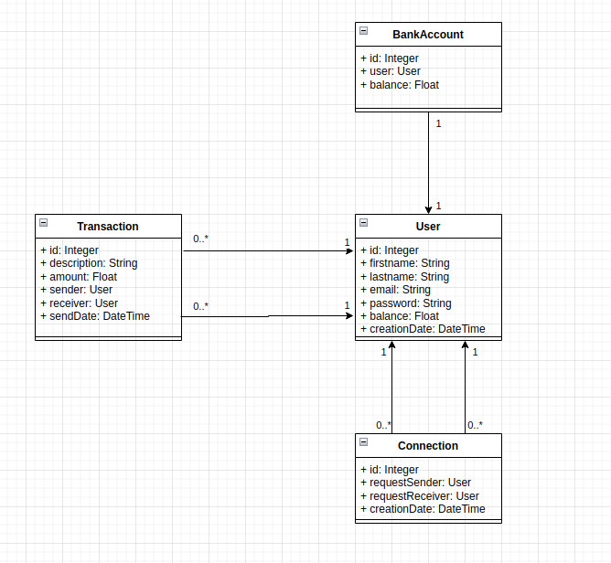
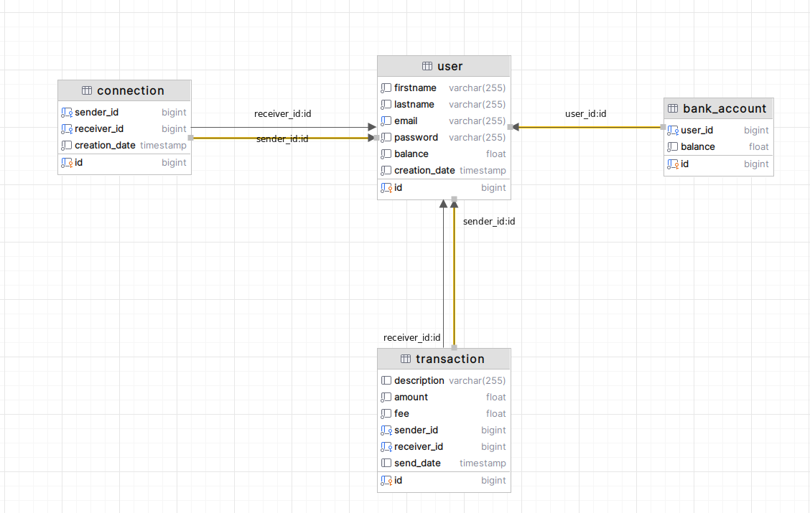

Initialisation de la base de données
====================================
Pour initialiser la base de données, il faut exécuter le script `data.sql` dans le dossier `resources/data`.

Connexion à l'application
==========================
Pour se connecter à l'application, il faut utiliser les identifiants suivants:
N'importe quel utilisateur du fichier data.sql, le passsword est toujours le prénom en minuscule.

Diagramme de classe

Modèle physqiue de données

